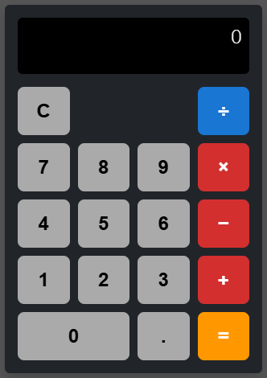

# calc-vue

Este é um projeto de uma calculadora simples e estilizada, desenvolvida com Vue 3 e Vite, utilizando Bootstrap para responsividade e um design moderno. O objetivo é fornecer uma interface intuitiva e funcional para operações aritméticas básicas.

## Descrição do Projeto

A Calc-Vue é uma calculadora web que realiza operações matemáticas básicas como adição, subtração, multiplicação e divisão. Possui um design limpo com botões estilizados em diferentes cores (cinza, laranja, vermelho e azul), além de calcular automaticamente os resultados ao pressionar "=".

## Funcionalidades

--Exibição em tempo real dos números e resultados.
--Botões para operações aritméticas básicas: +, -, ×, ÷.
--Botão "C" para limpar o display.
--Estilo moderno e responsivo, com:
--Fundo preto e cinza escuro.
--Botões destacados em laranja, vermelho e azul.
--Texto branco para maior contraste.

## Tecnologias Utilizadas

--Vue.js 3: Framework JavaScript progressivo para construção de interfaces de usuário.
--Vite: Ferramenta de build rápida e moderna para projetos web.
--Bootstrap 5: Biblioteca CSS para estilização e responsividade.

## Requisitos para Configuração

Ferramentas Recomendadas
--Editor de Código: VSCode
--Extensão Vue: Volar (Certifique-se de desativar o Vetur para evitar conflitos).

## Configuração do Projeto

Siga os passos abaixo para configurar e executar o projeto localmente:

1. Instalar Dependências
Execute o comando abaixo para instalar as dependências do projeto:

```sh
npm install
```

2. Executar o Servidor de Desenvolvimento
Para iniciar o servidor de desenvolvimento com hot-reload:

```sh
npm run dev
```

3. Gerar o Build para Produção
Compile os arquivos otimizados para produção:

```sh
npm run build
```

## Estrutura do Projeto

src/
├── components/
│   └── Calculator.vue   # Componente principal da calculadora
├── assets/              # Recursos estáticos (se aplicável)
├── App.vue              # Componente raiz
├── main.js              # Entrada principal do projeto
├── style.css            # Estilos globais (opcional)

## Captura de Tela
Interface da Calculadora


## Contribuições

Sinta-se à vontade para contribuir com melhorias ou novos recursos para este projeto. Para contribuir:

1. Faça um fork do projeto.
2. Crie uma branch para suas alterações:
```sh
git checkout -b minha-feature
```
3. Envie suas alterações:
```sh
git push origin minha-feature
```
4. Abra um Pull Request.

## Licença

Este projeto está licenciado sob a MIT License. Sinta-se à vontade para usá-lo e modificá-lo.

